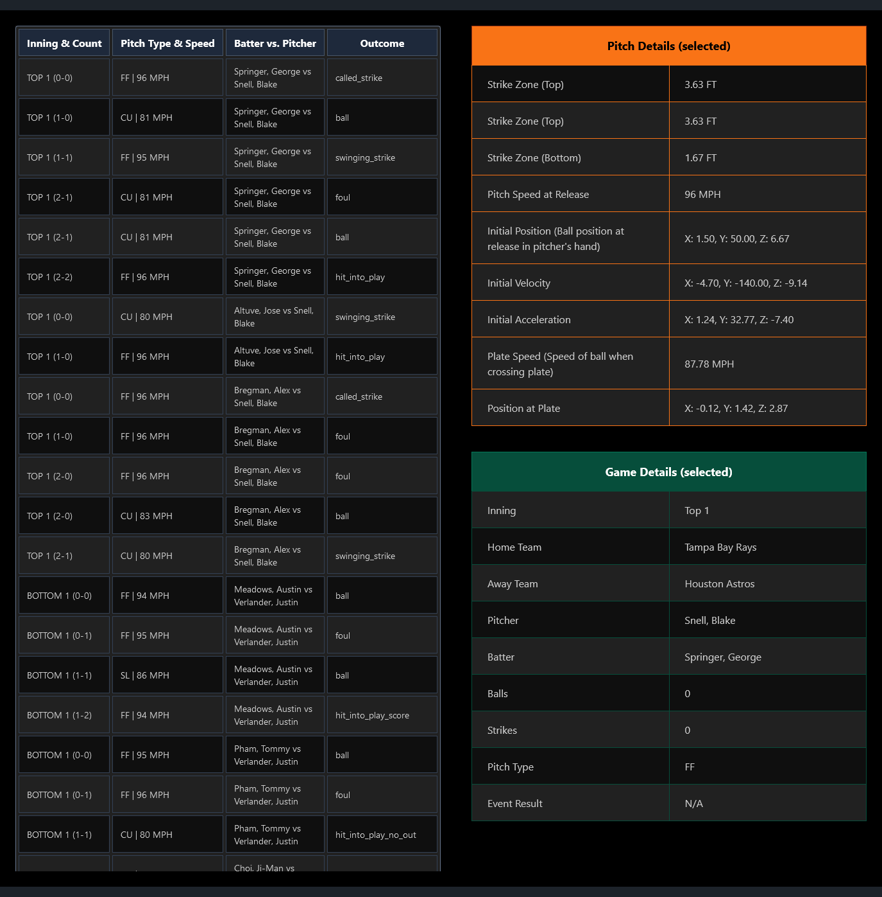

# Astros Data Frontend Application

## Installation

- Ensure you have a modern/recent version of Node.js installed system-wide. 

- Open a terminal instance in this repository and run the command:

  

  ```bash
  npm install
  ```

  

- Then, launch the local application by running: 

```bash
npm run dev
```


## Usage


This is a simple one-page application designed to let users explore and dive deeper into Astros game data. 



- The application's interface is divided into three primary sections. On the left, you'll find a scrollable table that provides play-by-play game data. This table starts from the top of the first inning and is designed to scroll in place, allowing you to review extensive game data while keeping other elements of the user interface steady.
- For a more detailed analysis of a specific play, simply click on any cell in the table. This action will populate the right-hand sections of the screen with additional information. You will see pitch-specific data in the middle and broader game details on the far right.
- Feel free to scroll through the play-by-play data on the left side of the screen. This feature allows you to compare plays and get a sense of how events unfolded throughout the game.

#### GO ASTROS!!! 


